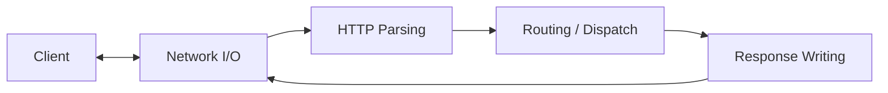

# Architecture

## Purpose

This document defines the current architectural view of the project.

It combines:

- conceptual architecture, which defines the major system responsibilities and flow
- initial detailed architecture, which identifies the first internal building blocks needed to support implementation

The goal is to make the system clear enough to design and implement without unnecessary process overhead.

## Architectural Approach

The system is organized around major responsibilities rather than around classes or file names.

At the highest level, the architecture is divided into:

- Network I/O
- HTTP Parsing
- Routing / Dispatch
- Response Writing

This structure is intended to keep the main request/response path understandable before refining the design into lower-level implementation elements.

## System Context

The project implements the server side of HTTP only.

The external interaction boundary is:

- a client connects over TCP
- the server receives HTTP request bytes
- the server parses and handles the request
- the server returns HTTP response bytes

## Initial Execution Model

The initial implementation will use a single-process, single-threaded, blocking I/O model.

The server will:

- create a listening socket
- accept one client connection at a time
- read from the connection
- produce a response
- write the response
- close the connection

This model is intentionally simple so the request/response path can be understood clearly before introducing concurrency or persistent connection support.

## Top-Level Block Diagram



## Top-Level Flow

```text
Client
  |
  v
Network I/O
  |
  v
HTTP Parsing
  |
  v
Routing / Dispatch
  |
  v
Response Writing
  |
  v
Network I/O
  |
  v
Client
```

## Top-Level Inputs and Outputs

| Item                          | Description                                       |
|-------------------------------|---------------------------------------------------|
| External input                | inbound TCP connection and incoming request bytes |
| External output               | outbound HTTP response bytes                      |
| Internal input to parser      | raw request bytes                                 |
| Internal output from parser   | structured HTTP request                           |
| Internal output from routing  | structured HTTP response                          |
| Internal output from writer   | serialized HTTP response bytes                    |

## Top-Level Responsibilities

| Subsystem           | Responsibility                                                  | Primary Output                                  | Not Responsible For                         |
|---------------------|-----------------------------------------------------------------|-------------------------------------------------|---------------------------------------------|
| Network I/O         | Accept connections and move bytes in and out of the system      | raw inbound bytes / transmitted outbound bytes  | HTTP message structure, routing decisions   |
| HTTP Parsing        | Convert inbound request bytes into structured HTTP request data | structured request                              | selecting handlers, writing responses       |
| Routing / Dispatch  | Select the appropriate handling path based on the request       | response representation                         | socket operations, byte-level serialization |
| Response Writing    | Convert structured response data into HTTP response bytes       | serialized response bytes                       | parsing requests, connection acceptance     |

## Connection Ownership

For the initial architecture, Network I/O owns the client connection.

This means:

- Network I/O accepts the connection
- Network I/O reads inbound bytes from the socket
- Network I/O writes outbound bytes to the socket
- higher-level subsystems do not access the socket directly

HTTP Parsing, Routing / Dispatch, and Response Writing operate only on data passed across subsystem boundaries.

## Core Request Lifecycle

1. The server accepts a client connection.
2. The system reads inbound bytes from the connection.
3. The system parses those bytes into a structured HTTP request.
4. The request is routed to the appropriate handling path.
5. A structured HTTP response is produced.
6. The response is serialized into HTTP response bytes.
7. The system writes the response back to the client connection.

## Core Data Representations

The architecture currently recognizes the following key data forms:

| Representation            | Purpose                                           |
|---------------------------|---------------------------------------------------|
| raw request bytes         | byte-oriented input received from the network     |
| structured HTTP request   | parsed request data used for routing and handling |
| structured HTTP response  | response data produced before serialization       |
| raw response bytes        | byte-oriented output written back to the client   |

The likely first core models are:

- `HttpRequest`
- `HttpResponse`

These are important data models, but they are not first-level architecture blocks.

## Initial Internal Decomposition

The following decomposition is intended to guide the first implementation steps.

### Network I/O

The initial Network I/O design is expected to include:

- **Listener**
  - create socket
  - bind
  - listen
  - accept incoming connections

- **Connection Handling**
  - represent an accepted client connection
  - manage connection lifetime
  - provide read and write entry points

- **Read Path**
  - receive inbound bytes from the client
  - define the first boundary between connection handling and parsing

- **Write Path**
  - transmit serialized response bytes to the client
  - define the return path from response writing back to the client

### HTTP Parsing

The initial HTTP Parsing design is expected to include:

- **Request Line Parsing**
  - method
  - target
  - version

- **Header Parsing**
  - parse request headers
  - capture `Host`, `Content-Length`, and `Connection` for the initial version

- **Message Assembly**
  - produce a structured request representation

- **Basic Validation**
  - malformed request handling
  - unsupported method handling
  - invalid version handling

### Routing / Dispatch

The initial Routing / Dispatch design is expected to include:

- **Route Selection**
  - identify which handling path should process the request

- **Handler Invocation**
  - call the selected handler using the structured request

- **Default Error Handling Paths**
  - unsupported method
  - no route found
  - invalid request path

- **Static File Handling Path**
  - static file serving is currently treated as a handling path within routing rather than as a first-level subsystem

### Response Writing

The initial Response Writing design is expected to include:

- **Status Line Generation**
  - HTTP version
  - status code
  - reason phrase

- **Header Serialization**
  - `Content-Length`
  - `Content-Type`
  - `Connection`

- **Body Serialization**
  - append body when present

- **Byte Output Assembly**
  - produce the final outbound HTTP response bytes

## Initial Internal Interfaces

The following internal boundaries are currently expected:

| From                | To                  | Interface / Boundary                |
|---------------------|---------------------|-------------------------------------|
| Network I/O         | HTTP Parsing        | inbound raw request bytes           |
| HTTP Parsing        | Routing / Dispatch  | structured request representation   |
| Routing / Dispatch  | Response Writing    | structured response representation  |
| Response Writing    | Network I/O         | outbound response bytes             |

## Error Flow

Errors may originate in:

- Network I/O during accept, read, or write
- HTTP Parsing when request data is malformed
- Routing / Dispatch when no valid handling path exists
- Response Writing when an internal failure occurs

The initial error-handling rule is:

- transport-level failures may terminate the connection
- HTTP-level failures should produce a structured HTTP error response when possible
- error responses should still be serialized through the normal response-writing path

## Design Priorities

The current architecture prioritizes:

- correctness before optimization
- clear subsystem boundaries
- understandable request flow
- simple first implementation slices
- design that can be refined incrementally

## Deferred for Later

The following items are intentionally deferred from the initial design and implementation focus:

- HTTP/2
- HTTP/3
- TLS
- WebSockets
- chunked transfer encoding
- advanced performance tuning
- full persistent connection support
- concurrency design beyond what is needed for the first working milestone

## Risks and Unknowns

The main architecture risks or open design questions at this stage are:

- how much buffering should belong to Network I/O versus HTTP Parsing
- what exact routing API should be used
- how `HttpRequest` and `HttpResponse` should be modeled internally
- when concurrency should be introduced without distorting the first implementation

## Architecture Exit Condition

This architecture is considered good enough to support implementation when:

- [x] the main system flow is clear
- [x] the major responsibilities are stable
- [x] the first milestone can be implemented without architectural guessing
- [x] lower-level code structure can be derived from these boundaries